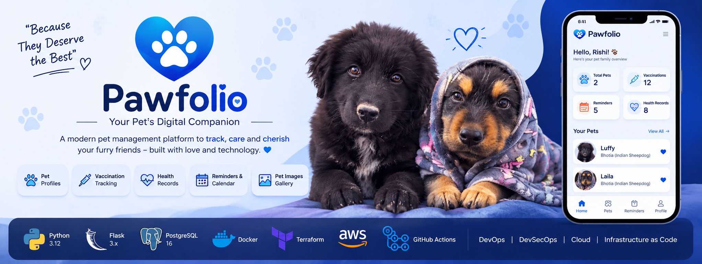
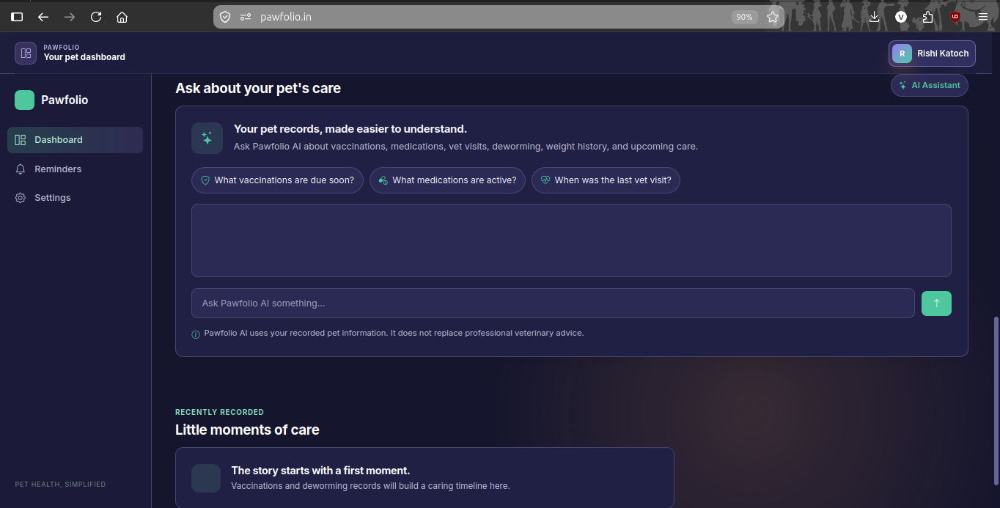
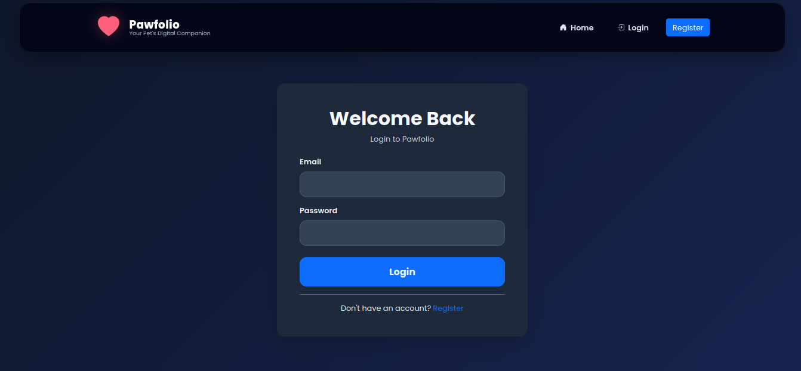
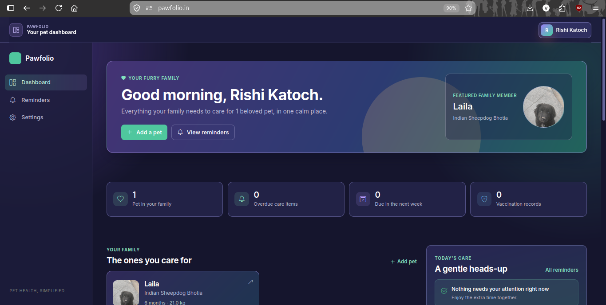
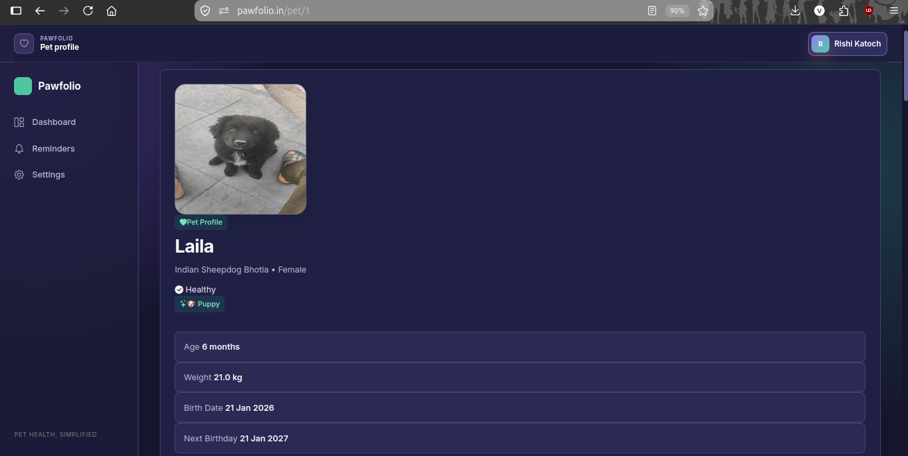

# 🐾 Pawfolio

<p align="center">
  
</p>

<h1 align="center">Pawfolio — Pet Health Management Platform</h1>

<p align="center">
  A production-deployed full-stack application built to demonstrate
  <strong>AWS, Kubernetes, Terraform, Docker, CI/CD, GitOps and DevSecOps</strong>
  practices through a real working project.
</p>

<p align="center">
  <a href="https://pawfolio.in">🌐 Live Production</a> •
  <a href="https://github.com/rishikatoch/pawfolio">GitHub Repository</a>
</p>

---

## 🌐 Live Production

**Production:** https://pawfolio.in

Pawfolio is currently deployed on **Amazon EKS** behind an AWS Application Load Balancer.

The project is intentionally more than a Flask application: the repository contains the application, containerization, infrastructure as code, Kubernetes packaging, GitOps configuration, deployment automation, security controls, secrets management and observability components.

---

# 🚀 Project Overview

Pawfolio is a pet health management platform for maintaining pet profiles and tracking important care records such as:

- Pet profiles
- Vaccination history
- Vaccination completion status
- Deworming schedules
- Medications
- Veterinary follow-ups
- Weight history
- Health information
- Upcoming reminders
- Overdue care
- AI-assisted pet-care information

The application started from a practical need to maintain records for my dogs and evolved into a production-oriented DevOps and Cloud portfolio project.

The primary engineering objective was to demonstrate the complete delivery lifecycle:

```text
Application Development
        ↓
Testing & Code Quality
        ↓
Security Scanning
        ↓
Container Build
        ↓
Container Registry
        ↓
Infrastructure as Code
        ↓
Kubernetes
        ↓
GitOps
        ↓
Blue-Green Deployment
        ↓
Automated Health Analysis
        ↓
Observability
```

---

# 🎯 Project Highlights

| Area | Implementation |
|---|---|
| Application | Flask / Python 3.12 |
| Database | PostgreSQL |
| Authentication | Flask-Login + Google OAuth |
| Containerization | Docker |
| Cloud | AWS |
| Kubernetes | Amazon EKS |
| Registry | Amazon ECR |
| Infrastructure | Terraform |
| Kubernetes Packaging | Helm |
| GitOps | Argo CD |
| Deployment Strategy | Argo Rollouts / Blue-Green |
| CI/CD | GitHub Actions |
| Secrets | AWS Secrets Manager + External Secrets |
| Kubernetes Policy | Kyverno |
| Code Security | Bandit / CodeQL |
| IaC Security | Checkov |
| Container Security | Trivy |
| Monitoring | Prometheus |
| Dashboards | Grafana |
| Deployment Metrics | DORA exporter |
| Application Server | Gunicorn |
| AI | OpenRouter |

---

# 🤖 Pawfolio AI

Pawfolio includes an AI assistant powered through **OpenRouter**.

The assistant is designed to use the pet's stored records as application context while keeping general pet-care information distinct from information actually stored in Pawfolio.

The AI rules include safeguards such as:

- Do not diagnose medical conditions.
- Do not replace a veterinarian.
- Do not recommend medication changes based solely on AI judgment.
- Escalate potentially serious or dangerous situations to a qualified veterinarian.
- Calculate relative dates from supplied dates rather than inventing dates.
- Treat completed historical vaccinations as completed records rather than overdue care.

<p align="center">
  
</p>

---

# 🏗 Production Architecture

```text
                         Internet
                            |
                            v
                   AWS Application
                  Load Balancer (ALB)
                            |
                            v
                 Kubernetes Ingress
                            |
                            v
                    Argo Rollouts
                            |
                +-----------+-----------+
                |                       |
                v                       v
          Active Service        Preview Service
                |                       |
                +-----------+-----------+
                            |
                            v
                    Flask Application
                     + Gunicorn
                            |
                +-----------+-----------+
                |                       |
                v                       v
            PostgreSQL             AWS Services
                                  / Secrets
```

The Kubernetes workload runs inside an **Amazon EKS** cluster.

The deployment uses Argo Rollouts to control production releases and provide active/preview service separation.

---

# 🔄 CI/CD + GitOps Workflow

The repository uses GitHub Actions for automated validation, security checks and deployment-related workflows.

A simplified delivery path is:

```text
Developer
   |
   v
GitHub
   |
   v
GitHub Actions
   |
   +--> Tests
   +--> Flake8
   +--> Bandit
   +--> CodeQL
   +--> Checkov
   +--> Trivy
   |
   v
Docker Image
   |
   v
Amazon ECR
   |
   v
Git / Helm Configuration
   |
   v
Argo CD
   |
   v
Amazon EKS
   |
   v
Argo Rollouts
   |
   v
Production
```

The repository separates application delivery from Kubernetes desired-state management using GitOps principles.

---

# 🧪 Continuous Integration

CI validates the project before deployment.

Typical checks include:

### Python compilation and tests

Application code is validated before an image is promoted.

### Flake8

Used for Python code-quality checks.

### Bandit

Used for Python security analysis.

### CodeQL

Used for deeper static analysis of supported source code.

### Checkov

Scans infrastructure-as-code definitions for security and configuration issues.

### Trivy

Used for container vulnerability scanning.

---

# 🚀 Blue-Green Deployments

Pawfolio uses **Argo Rollouts** rather than relying only on a standard Kubernetes Deployment.

The production rollout provides:

- Active service
- Preview service
- Blue-Green releases
- Controlled promotion
- Health verification
- Rollout analysis
- Rollback capability

Conceptually:

```text
                  New Version
                      |
                      v
                 Preview Pods
                      |
                      v
             Health / Analysis
                      |
             +--------+--------+
             |                 |
           Pass              Fail
             |                 |
             v                 v
          Promote           Abort
             |                 |
             v                 v
        Active Traffic      Previous
                            Version
```

The rollout configuration also integrates an `AnalysisTemplate` for post-promotion health analysis.

---

# ❤️ Deployment Health Verification

Production deployment validation is not limited to checking whether a Kubernetes pod starts.

The platform validates rollout health and application availability.

The repository includes:

- Argo Rollouts health analysis
- Post-promotion analysis
- Rollout status checks
- Kubernetes readiness
- Service health
- Prometheus-based analysis components

This makes deployment verification part of the delivery process rather than a manual afterthought.

---

# 🔐 Secrets Management

Production secrets are not stored directly in Git.

The production flow is:

```text
AWS Secrets Manager
        |
        v
External Secrets Operator
        |
        v
Kubernetes Secret
        |
        v
Pawfolio Pod
```

The application has used this mechanism for sensitive configuration such as:

- Database credentials
- Flask secret
- Google OAuth credentials
- OpenRouter API key

This separates application configuration from source control and allows production secrets to be managed through AWS.

---

# 🛡 DevSecOps

Security is integrated into multiple layers of the project.

## Application Layer

- Bandit
- CodeQL
- Input validation
- Authentication controls
- Environment-based secret configuration

## Container Layer

- Trivy image scanning
- Non-root container configuration
- Resource controls

## Infrastructure Layer

- Terraform
- Checkov
- IAM-based AWS access
- Version-controlled infrastructure

## Kubernetes Layer

- Kyverno policies
- Non-root enforcement
- Resource-limit enforcement
- Network policy configuration
- Secrets supplied through External Secrets

The objective is to apply security controls throughout the software delivery lifecycle instead of treating security as a final manual review.

---

# ☸️ Kubernetes

The production platform runs on **Amazon EKS**.

Kubernetes resources include components such as:

- Deployments / Rollouts
- Services
- Ingress
- Configurations
- Secrets
- Network Policies
- ServiceMonitor
- Prometheus rules

Helm is used to package the application Kubernetes configuration.

---

# 📦 Helm

The repository contains a Helm chart for Pawfolio.

The chart manages Kubernetes resources required by the application, including:

- Rollout configuration
- Active/preview services
- Ingress
- Network policies
- Monitoring configuration
- Prometheus alerts
- DORA components
- Grafana dashboard configuration

This keeps Kubernetes configuration reusable and version-controlled.

---

# 📊 Observability & DORA

Production observability includes:

- Prometheus
- Grafana
- ServiceMonitor
- Prometheus alert rules
- DORA exporter
- Argo Rollouts AnalysisTemplate
- DORA dashboard

The objective is to measure not only whether the application is running, but also how effectively software is being delivered.

The project includes DORA-oriented metrics and dashboards covering deployment performance and reliability signals.

---

# 📈 Monitoring Architecture

```text
Pawfolio / Kubernetes
        |
        v
   Prometheus
        |
   +----+----+
   |         |
   v         v
Alerts    Grafana
             |
             v
        DORA Dashboard
```

---

# ☁️ AWS Infrastructure

AWS is used as the production cloud platform.

Major components include:

- Amazon EKS
- Amazon ECR
- AWS Application Load Balancer
- AWS Secrets Manager
- VPC/networking components
- IAM
- Supporting infrastructure managed by Terraform

---

# 🏗 Infrastructure as Code

Terraform is used to provision and manage AWS infrastructure.

The infrastructure is maintained as version-controlled configuration rather than being created manually through the AWS Console.

This provides:

- Reproducibility
- Version control
- Reviewable infrastructure changes
- Consistent environments
- Easier recovery
- Infrastructure drift visibility

Typical Terraform workflow:

```bash
terraform init
terraform validate
terraform plan
terraform apply
```

For planned deployments, a saved plan can also be used:

```bash
terraform plan -out=tfplan
terraform apply tfplan
```

---

# 🗂 Repository Structure

```text
pawfolio/
├── .github/
│   └── workflows/
│       ├── CI
│       ├── CodeQL
│       ├── Deploy
│       ├── Security
│       └── Terraform
│
├── app/
│   ├── routes/
│   ├── services/
│   ├── templates/
│   ├── static/
│   └── models.py
│
├── argocd/
│
├── pawfolio-chart/
│   ├── templates/
│   └── values.yaml
│
├── terraform/
│
├── migrations/
│
├── scripts/
│
├── tests/
│
├── screenshots/
│
├── Dockerfile
├── docker-compose.yml
├── requirements.txt
├── run.py
└── README.md
```

---

# 📸 Application Screenshots

## Authentication

<p align="center">
  
</p>

## Dashboard

<p align="center">
  
</p>

## Pet Profile

<p align="center">
  
</p>

## AI Assistant

<p align="center">
  
</p>

# 🐳 Local Development

## Prerequisites

Recommended:

- Python 3.12
- PostgreSQL
- Git
- Docker / Docker Compose

Clone the repository:

```bash
git clone https://github.com/rishikatoch/pawfolio.git
cd pawfolio
```

Create a virtual environment:

```bash
python3 -m venv .venv
source .venv/bin/activate
```

Install dependencies:

```bash
pip install -r requirements.txt
```

Apply migrations:

```bash
flask db upgrade
```

Start the application:

```bash
python run.py
```

Or:

```bash
flask run
```

---

# 🐳 Docker Compose

The project can also be run using Docker Compose.

```bash
docker compose up --build
```

Run in detached mode:

```bash
docker compose up -d --build
```

View logs:

```bash
docker compose logs -f
```

Stop the stack:

```bash
docker compose down
```

---

# 🗄 Database Migrations

Pawfolio uses Flask-Migrate / Alembic for schema migrations.

Create a migration:

```bash
flask db migrate -m "describe change"
```

Apply migrations:

```bash
flask db upgrade
```

Check the current revision:

```bash
flask db current
```

Verify that the model and database schema are aligned:

```bash
flask db check
```

---

# 👨‍💻 About the Author

## Rishi Katoch

DevOps and Cloud-focused engineer building practical projects around:

**AWS • Kubernetes • Terraform • Docker • GitHub Actions • GitOps • DevSecOps • Python**

The goal of Pawfolio is not simply to demonstrate that I can build a web application, but that I can take an application through the broader engineering lifecycle:

```text
Build
  ↓
Test
  ↓
Secure
  ↓
Containerize
  ↓
Provision
  ↓
Deploy
  ↓
Observe
  ↓
Improve
```

### Connect

- GitHub: https://github.com/rishikatoch
- LinkedIn: https://www.linkedin.com/in/rishi-katoch-885732322/

---

# 📄 License

MIT License.

---

<p align="center">
  <strong>🐾 Pawfolio</strong>
  <br>
  Engineered as a practical demonstration of modern software delivery using
  DevOps, Cloud and DevSecOps practices.
</p>
